<table width="100%">
  <tr>
    <!-- LEFT COLUMN: Your Metrics -->
    <td width="50%" valign="top">
      
    </td>
    
    <!-- RIGHT COLUMN: GIFs & Shields -->
    <td width="50%" valign="top">
      

        <!-- First GIF (Golden Forest) -->
        
        
          

        <!-- Second GIF (Twitter Animation) -->
        <!-- Make sure the src name matches exactly what you named the uploaded file -->
        
        
          

        <!-- Third GIF (Chainsaw Man) -->
        
      

      
       

      <!-- The Shields -->
      

        <b>Languages</b> 
        
        
          
        
        <b>AI / ML</b> 
        
        
        
        
        
        
        
        
        
        
        
        
        
        
        
        
        
          

        <b>Backend / Fullstack</b> 
        
        
        
        
        
        
        
        
        
          

        <b>Databases</b> 
        
        
        
          

        <b>DevOps / Tools</b> 
        
        
        
        
        
        
        
      

    </td>
  </tr>
</table>
